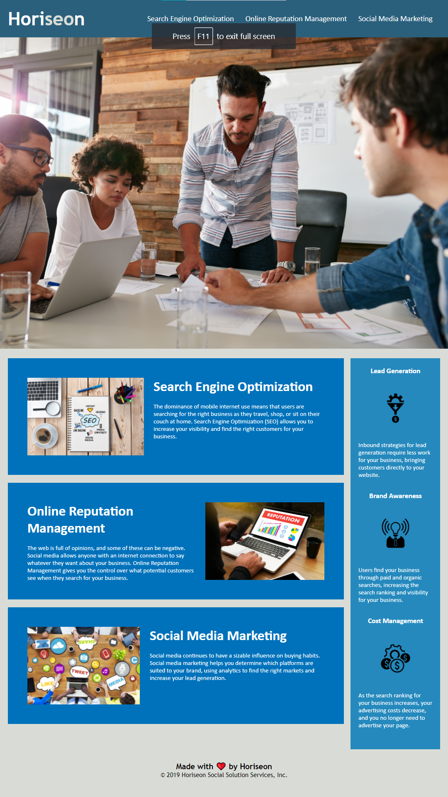

# Homework 01

Week one of Coding Bootcamp officially down. Thats means it's time to get to work and finish the first homework assignement.

---

## Horisean
The first change made to the HTML code was fixing the structure of elements for a more efficient way to begin correcting and consolidating lines. Many images needed to be updated with a accessible alt attribute to meet standards. Images and paragraphs using the same css style were changed to a new class that cleaned up our style page. Title of webpage needed to be changed to the title of the website for easy optimization for search engines. Links st the top of the page were fixed. All changes were recorded in the html and css files.

## Screenshot
The following image is a screen shot of the finished project. It shows the resemblance to the provided mock-up in the homework instructions.

## Link
Below is the link to the finished work.

https://jack-ie.github.io/homework-01/